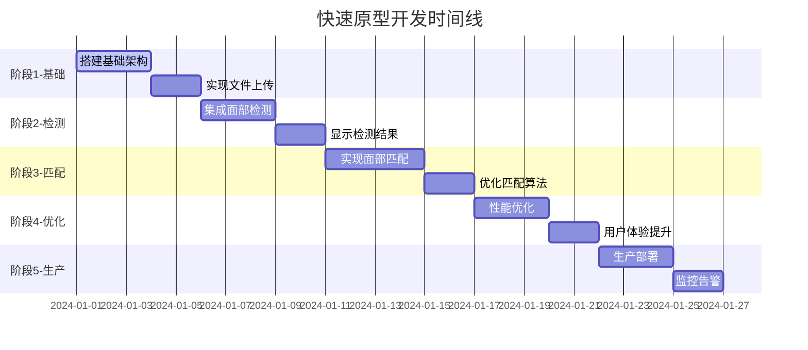
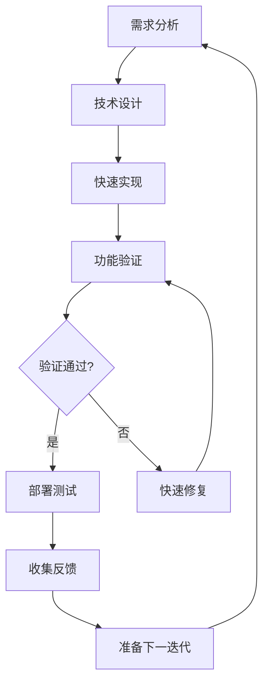

# 快速原型开发计划

## 开发方法论

采用**快速迭代原型模式**，每个迭代都实现一个可验证的功能集合，确保持续交付价值。每个阶段都有明确的成功标准和验证方法。

## 迭代计划概览



---

## 🚀 迭代 1: 基础架构原型 (3-5天)

### 目标
建立最基础的文件上传和存储功能，验证 Turborepo + Cloudflare 技术栈。

### 功能范围
- [x] Turborepo 单体仓库搭建
- [x] Next.js 前端基础页面
- [x] Hono API 基础路由
- [x] Cloudflare R2 文件上传
- [x] 基础的文件格式验证

### 技术实现
```typescript
// 迭代 1 最小功能集
interface Iteration1Features {
  frontend: {
    uploadPage: "简单的文件选择和上传界面";
    progressIndicator: "上传进度显示";
    errorHandling: "基础错误提示";
  };
  backend: {
    uploadEndpoint: "POST /api/upload";
    fileValidation: "文件类型和大小检验";
    r2Storage: "文件存储到 Cloudflare R2";
  };
  infrastructure: {
    turborepo: "工作区配置和构建管道";
    deployment: "基础 Cloudflare Pages/Workers 部署";
  };
}
```

### 验证标准
- ✅ 用户可以选择图片文件并上传
- ✅ 上传进度正常显示
- ✅ 文件成功存储到 R2，返回文件 URL
- ✅ 错误情况正确处理（文件过大、格式不支持等）
- ✅ 前后端部署成功，可以通过公网访问

### 交付物
- 可工作的文件上传网站
- R2 存储桶配置
- 基础 CI/CD 管道
- 开发环境文档

---

## 🧠 迭代 2: 面部检测原型 (3-5天)

### 目标
集成容器化面部检测服务，实现基础的人脸识别能力。

### 功能范围
- [x] Cloudflare Containers 服务搭建
- [x] @vladmandic/face-api 集成
- [x] 面部检测 API 端点
- [x] 检测结果可视化显示

### 技术实现
```typescript
// 迭代 2 新增功能
interface Iteration2Features {
  container: {
    faceDetection: "容器化面部检测服务";
    modelLoading: "AI 模型加载和缓存";
    apiEndpoint: "POST /api/detect-faces";
  };
  frontend: {
    resultDisplay: "面部检测结果展示";
    boundingBox: "人脸框标注显示";
    confidence: "置信度分数显示";
  };
  integration: {
    workerContainer: "Worker 到 Container 通信";
    errorHandling: "容器服务错误处理";
  };
}
```

### 验证标准
- ✅ 用户上传照片后能自动检测人脸
- ✅ 检测结果以边界框形式显示在图片上
- ✅ 显示检测到的人脸数量和置信度
- ✅ 容器服务可以正常启动和响应
- ✅ 检测失败时有明确的错误提示

### 交付物
- 面部检测容器服务
- 检测结果可视化界面
- 容器部署配置
- 面部检测性能基准

---

## 🔍 迭代 3: 面部匹配原型 (4-6天)

### 目标
实现核心的人脸匹配功能，用户可以找到相似的人脸照片。

### 功能范围
- [x] 面部特征编码提取
- [x] 相似度匹配算法
- [x] 匹配结果排序和过滤
- [x] 批量照片预处理

### 技术实现
```typescript
// 迭代 3 新增功能
interface Iteration3Features {
  matching: {
    featureExtraction: "128维面部特征编码";
    similaritySearch: "欧几里得距离匹配";
    resultRanking: "按相似度排序";
    thresholdFiltering: "置信度阈值过滤";
  };
  database: {
    faceEncodings: "面部编码存储 (D1)";
    photoMetadata: "照片元数据管理";
    searchJobs: "搜索任务状态跟踪";
  };
  frontend: {
    resultsGallery: "匹配结果画廊显示";
    similarityScore: "相似度分数显示";
    pagination: "结果分页浏览";
  };
}
```

### 验证标准
- ✅ 用户上传查询照片后能找到相似人脸
- ✅ 匹配结果按相似度正确排序
- ✅ 相似度分数准确显示
- ✅ 可以调整匹配阈值过滤结果
- ✅ 搜索状态实时更新

### 交付物
- 完整的人脸匹配系统
- 匹配算法性能优化
- 数据库 schema 和索引
- 匹配准确性测试报告

---

## ⚡ 迭代 4: 性能和体验优化 (3-5天)

### 目标
优化系统性能，提升用户体验，增加实用功能。

### 功能范围
- [x] 图像处理优化
- [x] 缓存策略实现
- [x] UI/UX 改进
- [x] 批量处理功能

### 技术实现
```typescript
// 迭代 4 优化功能
interface Iteration4Features {
  performance: {
    imageOptimization: "WebP 格式转换和压缩";
    thumbnailGeneration: "缩略图自动生成";
    resultCaching: "匹配结果缓存";
    lazyLoading: "结果懒加载";
  };
  userExperience: {
    dragDropUpload: "拖拽上传支持";
    progressFeedback: "详细进度反馈";
    errorRecovery: "错误恢复机制";
    responsiveDesign: "响应式设计优化";
  };
  features: {
    batchUpload: "批量文件上传";
    searchHistory: "搜索历史记录";
    resultExport: "结果导出功能";
  };
}
```

### 验证标准
- ✅ 图片上传和处理速度提升 50%
- ✅ 界面响应时间 < 200ms
- ✅ 支持批量上传多个文件
- ✅ 移动端体验良好
- ✅ 错误状态有清晰的恢复路径

### 交付物
- 性能优化报告
- 用户体验测试结果
- 响应式设计实现
- 批量处理功能

---

## 🚀 迭代 5: 生产就绪 (3-5天)

### 目标
使系统达到生产环境标准，包括监控、安全、扩展性。

### 功能范围
- [x] 生产环境部署
- [x] 监控和告警
- [x] 安全强化
- [x] 扩展性测试

### 技术实现
```typescript
// 迭代 5 生产功能
interface Iteration5Features {
  production: {
    deployment: "生产环境 CI/CD";
    monitoring: "性能监控和日志";
    security: "安全强化和验证";
    scaling: "自动扩展配置";
  };
  reliability: {
    healthChecks: "健康检查端点";
    errorTracking: "错误追踪和报告";
    backup: "数据备份策略";
    recovery: "灾难恢复方案";
  };
  operations: {
    analytics: "使用分析统计";
    rateLimit: "API 速率限制";
    documentation: "API 文档生成";
    loadTesting: "负载测试";
  };
}
```

### 验证标准
- ✅ 系统可以处理 1000+ 并发用户
- ✅ 99.9% 可用性保证
- ✅ 安全扫描无高危漏洞
- ✅ 监控和告警正常工作
- ✅ 完整的操作文档

### 交付物
- 生产环境系统
- 监控仪表板
- 安全审计报告
- 运维操作手册

---

## 🔄 迭代开发流程

### 每个迭代的标准流程



### 每日开发节奏
- **上午**: 专注编码实现
- **下午**: 集成测试和验证
- **晚上**: 部署和反馈收集

### 验证方法
1. **功能验证**: 每个功能都有明确的验收标准
2. **性能验证**: 关键指标监控 (响应时间、准确率等)
3. **用户验证**: 真实用户场景测试
4. **技术验证**: 代码质量和架构健康度检查

---

## 🛠 开发工具和环境

### 快速开发工具栈
```typescript
// 开发效率工具
interface DevelopmentTools {
  hotReload: {
    frontend: "Next.js Fast Refresh";
    backend: "wrangler dev";
    containers: "容器热重载";
  };
  testing: {
    unit: "Vitest + 快速反馈";
    integration: "API 自动化测试";
    e2e: "Playwright 关键路径";
  };
  debugging: {
    logging: "结构化日志输出";
    profiling: "性能分析工具";
    monitoring: "实时性能监控";
  };
}
```

### 迭代验证环境
- **开发环境**: 本地开发和调试
- **测试环境**: 自动化测试和集成验证
- **预览环境**: 每个迭代的演示环境
- **生产环境**: 最终部署环境

---

## 📊 成功指标跟踪

### 每个迭代的关键指标

| 迭代 | 核心指标 | 目标值 | 验证方法 |
|------|----------|--------|----------|
| 1 | 文件上传成功率 | >95% | 自动化测试 |
| 2 | 面部检测准确率 | >90% | 人工验证 + 基准测试 |
| 3 | 匹配查询响应时间 | <5秒 | 性能监控 |
| 4 | 用户体验评分 | >4.0/5.0 | 用户反馈 |
| 5 | 系统可用性 | >99.9% | 监控系统 |

### 技术债务管理
- 每个迭代结束后评估技术债务
- 在下一迭代开始前处理关键技术债务
- 保持代码质量和架构清晰度

这个快速原型开发计划确保每个迭代都能交付可验证的价值，同时保持快速的开发节奏和高质量的代码。每个阶段都有明确的成功标准和验证方法，支持持续迭代改进。 